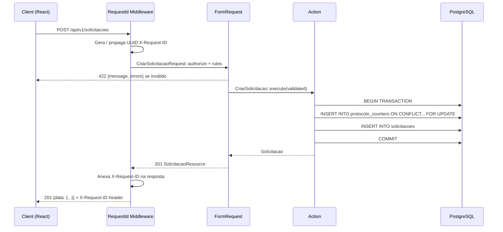
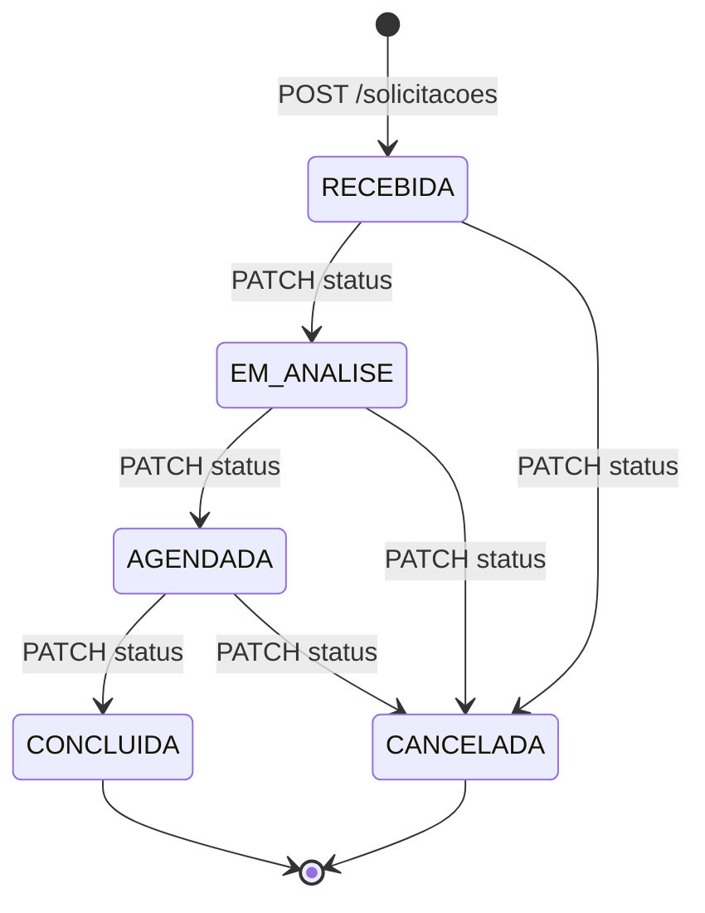

# Arquitetura — V-Lab Solicitações

## Visão Geral

```
┌─────────────┐   HTTP/JSON   ┌──────────────────────────┐   pg_pdo   ┌──────────────┐
│  React SPA  │ ───────────► │   Laravel 11 API (PHP 8.3) │ ─────────► │ PostgreSQL 16│
│  (Vite/TS)  │ ◄─────────── │   porta 8000               │ ◄───────── │  porta 5432  │
└─────────────┘               └──────────────────────────┘            └──────────────┘
   porta 5173                         │
                              RequestId Middleware
                              (X-Request-ID header)
                              Logs JSON → stderr
```

## Fluxo de uma requisição



## Diagrama de Status



## Estrutura de Pastas (Backend)

```
backend/
├── app/
│   ├── Domain/
│   │   ├── Health/
│   │   │   └── HealthController.php
│   │   └── Solicitacoes/
│   │       ├── Actions/
│   │       │   ├── CriarSolicitacao.php       # lógica de negócio + protocolo
│   │       │   └── AtualizarStatusSolicitacao.php  # máquina de estados
│   │       └── Http/
│   │           ├── Controllers/
│   │           │   └── SolicitacaoController.php  # thin controller
│   │           ├── Requests/
│   │           │   ├── CriarSolicitacaoRequest.php
│   │           │   ├── ListarSolicitacoesRequest.php
│   │           │   └── AtualizarStatusRequest.php
│   │           └── Resources/
│   │               └── SolicitacaoResource.php
│   ├── Http/
│   │   └── Middleware/
│   │       └── RequestId.php
│   └── Models/
│       └── Solicitacao.php
├── database/
│   ├── factories/SolicitacaoFactory.php
│   ├── migrations/
│   └── seeders/
│       ├── DatabaseSeeder.php
│       └── SolicitacoesSeeder.php       # idempotente via firstOrCreate
├── routes/api.php
└── tests/
    └── Feature/
        ├── HealthTest.php
        ├── CriarSolicitacaoTest.php
        ├── AtualizarStatusTest.php
        └── ListarSolicitacoesTest.php
```

## Decisões de Design

| Decisão | Escolha | Motivo |
|---|---|---|
| Protocolo único | Upsert + `lockForUpdate` em `protocolo_counters` | Evita race condition sem sequence global; suporta rollback |
| Transições de status | Tabela `TRANSICOES` em Action | Toda regra de negócio fora do controller; fácil de testar |
| Geração de X-Request-ID | Middleware global no grupo `api` | Rastreabilidade sem acoplamento ao domínio |
| Seeders idempotentes | `firstOrCreate(['protocolo' => ...])` | `db:seed` pode rodar N vezes sem duplicar dados |
| Logs estruturados | JSON via `JsonFormatter` → stderr | Compatível com Loki/CloudWatch sem parsear texto |
| Error envelope único | `{message, errors}` em todos os erros | Frontend trata erros de forma uniforme |

## Evolução Futura

- **Autenticação:** Laravel Sanctum com tokens API para operadores
- **Fila de notificações:** Job `NotificarSolicitante` via `database` driver → SQS em produção
- **Eventos de domínio:** `SolicitacaoStatusAtualizado` → listeners desacoplados
- **Microsserviços:** Health + Solicitações já estão em namespaces separados — isolamento trivial
