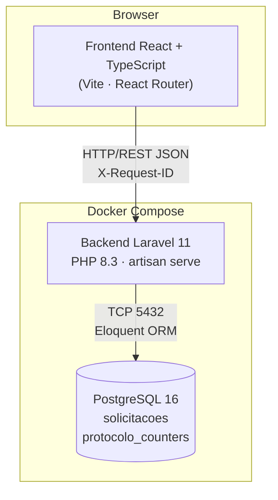

# Arquitetura — Solicitações de Atendimento

> Este documento é preenchido após o fluxo integrado estar estável. O esqueleto já existe para que o agente final o complete sem criar um arquivo do zero.

## 1. Visão geral

Sistema full stack para registro e acompanhamento de solicitações de atendimento em unidades públicas de saúde. Composto por três camadas desacopladas: interface React, API Laravel e banco PostgreSQL, orquestradas via Docker Compose.

## 2. Diagrama de camadas



*(Preencher com diagrama Mermaid real após a integração estar funcionando)*

## 3. Fluxo de uma requisição — criação de solicitação

```
Browser → POST /api/v1/solicitacoes
  → RequestId middleware (propaga/gera X-Request-ID)
  → CriarSolicitacaoRequest (valida campos, rejeita status no body)
  → SolicitacaoController::store()
  → CriarSolicitacao::execute() [DB::transaction]
      → INSERT ... ON CONFLICT DO NOTHING em protocolo_counters
      → SELECT ... FOR UPDATE em protocolo_counters
      → incrementa ultimo_numero, formata SOL-AAAA-NNNN
      → INSERT em solicitacoes (status = RECEBIDA)
  → SolicitacaoResource (serializa data_criacao, data_atualizacao)
  → 201 JSON { "data": Solicitacao }
  → RequestId middleware.terminate() loga api_request com request_id, duration_ms
```

## 4. Organização do backend

| Camada | Responsabilidade |
|---|---|
| `FormRequest` | Validação e normalização de entradas |
| `Controller` | Orquestração: Request → Action → Resource |
| `Action` | Regras de negócio, transações, geração de protocolo, máquina de estados |
| `Resource` | Serialização e contrato de saída (renomeia created_at → data_criacao) |
| `Model` | Persistência, casts, relações; não decide transições nem gera protocolo |
| `Middleware RequestId` | Propagação de X-Request-ID e logs estruturados JSON |

## 5. Máquina de estados

Centralizada exclusivamente em `AtualizarStatusSolicitacao`. O frontend pode esconder opções impossíveis por usabilidade, mas não é fonte de verdade.

```
RECEBIDA → EM_ANALISE | CANCELADA
EM_ANALISE → AGENDADA | CANCELADA
AGENDADA → CONCLUIDA | CANCELADA
CONCLUIDA → (terminal)
CANCELADA → (terminal)
```

Toda transição executa sob `DB::transaction` com `lockForUpdate` para garantir consistência em requisições concorrentes.

## 6. Geração de protocolo

Formato: `SOL-AAAA-NNNN`. Estratégia upsert + lock:

1. `INSERT INTO protocolo_counters (ano, ultimo_numero) VALUES (?, 0) ON CONFLICT DO NOTHING`
2. `SELECT ... FOR UPDATE` na linha do ano
3. Incrementa `ultimo_numero`, formata protocolo
4. Insere a solicitação na mesma transação

Garante unicidade sem race condition. O índice UNIQUE em `protocolo` é defesa final.

## 7. Banco de dados

Tabelas: `solicitacoes` e `protocolo_counters`. Schema evolui exclusivamente por migrations do Laravel.

Índices em `status`, `categoria` e `prioridade` para otimizar os filtros da listagem.

CHECK constraints garantem enums válidos e que `justificativa_prioridade` seja preenchida quando `prioridade = 'URGENTE'`.

## 8. Decisões técnicas e justificativas

| Decisão | Justificativa |
|---|---|
| Organização por domínio (`app/Domain/Solicitacoes/`) | Agrupa por funcionalidade em vez de camada técnica; facilita extração futura |
| Sem Repository/CQRS/DTO | O domínio tem um único agregado simples; abstrações adicionais aumentariam complexidade sem benefício demonstrável |
| `php artisan serve` no Docker | Pragmático para ambiente de avaliação; produção usaria FPM + Nginx |
| PostgreSQL nos testes | Testes de constraints, locks e concorrência exigem comportamento real do banco |
| 409 para transição inválida | Distingue conflito de estado (409) de entrada malformada (422) semanticamente |
| `APP_SEED=true` no Compose | Facilita avaliação sem exigir passo manual; idempotente para não duplicar dados |

## 9. Visão de evolução e integração com microsserviços

*(Preencher após o fluxo integrado estar estável)*

O módulo atual é um monólito Laravel coeso, organizado por domínio. Uma evolução natural seria:

- **Serviço de Notificações**: ao transicionar para `AGENDADA` ou `CONCLUIDA`, publicar evento em fila (ex: Laravel Queues + Redis) consumido por serviço separado responsável por notificar o solicitante.
- **API Gateway**: se outros domínios (Agenda, Prontuário) precisarem consultar solicitações, expor contratos estáveis e versionar a API (`/api/v2/...`).
- **Separação de leitura/escrita**: a listagem com filtros/paginação poderia ser atendida por uma réplica de leitura do PostgreSQL, sem alterar a estrutura de Commands/Queries no Laravel.
- **Event Sourcing eventual**: se o histórico completo de transições de status se tornar requisito de auditoria, o modelo poderia evoluir para persistir `SolicitacaoStatusAtualizado` como eventos imutáveis.

## 10. Limites e limitações conhecidas

*(Preencher antes da entrega final)*

- [ ] Descrever limitações conhecidas da implementação atual
- [ ] Listar funcionalidades não implementadas (se houver)
- [ ] Descrever eventuais ajustes necessários para executar em outros ambientes
