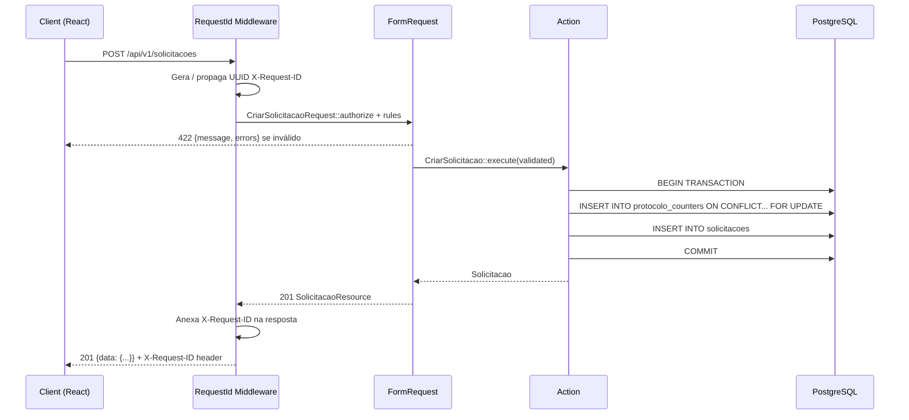
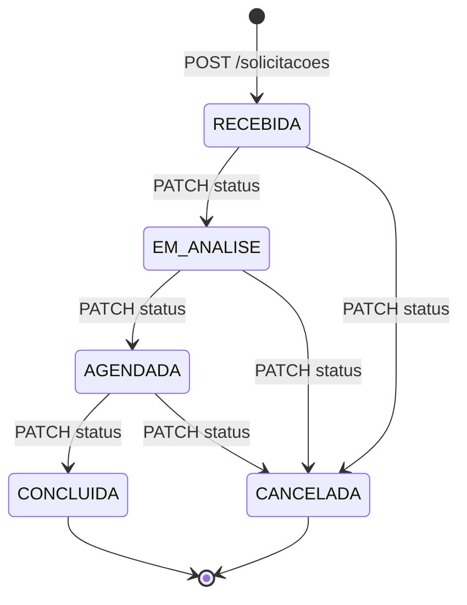
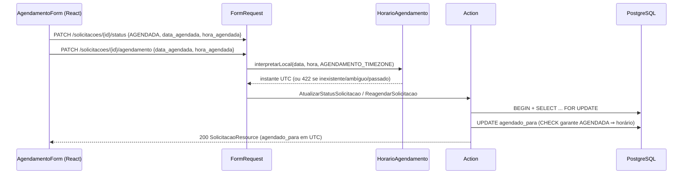

# Arquitetura — V-Lab Solicitações

## Visão Geral

```
┌─────────────┐   HTTP/JSON   ┌──────────────────────────┐   pg_pdo   ┌──────────────┐
│  React SPA  │ ───────────► │   Laravel 11 API (PHP 8.3) │ ─────────► │ PostgreSQL 16│
│  (Vite/TS)  │ ◄─────────── │   porta 8000               │ ◄───────── │  porta 5432  │
└─────────────┘               └──────────────────────────┘            └──────────────┘
   porta 5173                         │
                              RequestId Middleware
                              (X-Request-ID header)
                              Logs JSON → stderr
```

## Fluxo de uma requisição



## Diagrama de Status



## Fluxo de agendamento

O agendamento é um dado complementar de `AGENDADA`, não um estado novo. O agendamento inicial continua sendo a transição `EM_ANALISE → AGENDADA` em `AtualizarStatusSolicitacao`; o reagendamento é uma Action separada que só altera `agendado_para`.



A consulta diária (`GET /solicitacoes?data_agendada=`) usa `HorarioAgendamento::limitesUtcDoDia` para o intervalo semiaberto `[início do dia local, início do seguinte)` e ordena por horário, prioridade, protocolo e id. Horários iguais são permitidos: não há capacidade, conflito de vaga nem check-in.

## Estrutura de Pastas (Backend)

```
backend/
├── app/
│   ├── Domain/
│   │   ├── Health/
│   │   │   └── HealthController.php
│   │   └── Solicitacoes/
│   │       ├── Actions/
│   │       │   ├── CriarSolicitacao.php       # lógica de negócio + protocolo
│   │       │   ├── AtualizarSolicitacao.php   # edição de dados abertos
│   │       │   ├── AtualizarStatusSolicitacao.php  # máquina de estados + agendamento inicial
│   │       │   ├── ReagendarSolicitacao.php   # só altera agendado_para de AGENDADA
│   │       │   └── ApagarSolicitacao.php      # extensão documentada
│   │       ├── Support/
│   │       │   ├── HorarioAgendamento.php     # data/hora local <-> UTC, sem normalização silenciosa
│   │       │   ├── TurnoAgendamento.php       # deriva/limita turno (MANHA/TARDE/NOITE)
│   │       │   └── MascararContato.php        # mascara celular do paciente para a API
│   │       └── Http/
│   │           ├── Controllers/
│   │           │   └── SolicitacaoController.php  # thin controller
│   │           ├── Requests/
│   │           │   ├── CriarSolicitacaoRequest.php
│   │           │   ├── ListarSolicitacoesRequest.php
│   │           │   ├── AtualizarStatusRequest.php
│   │           │   ├── ReagendarSolicitacaoRequest.php
│   │           │   ├── AtualizarSolicitacaoRequest.php
│   │           │   ├── ListarFilaRequest.php
│   │           │   ├── ListarFaltasRequest.php
│   │           │   ├── RegistrarTentativaContatoRequest.php
│   │           │   └── ReagendarAposFaltaRequest.php
│   │           └── Resources/
│   │               ├── SolicitacaoResource.php
│   │               ├── PacienteResumoResource.php
│   │               ├── EntradaFilaResource.php
│   │               ├── AgendamentoResource.php
│   │               └── TentativaContatoResource.php
│   ├── Http/
│   │   └── Middleware/
│   │       └── RequestId.php
│   └── Models/
│       └── Solicitacao.php
├── database/
│   ├── factories/SolicitacaoFactory.php
│   ├── migrations/
│   └── seeders/
│       ├── DatabaseSeeder.php
│       └── SolicitacoesSeeder.php       # idempotente via firstOrCreate
├── routes/api.php
└── tests/
    └── Feature/
        ├── HealthTest.php
        ├── CriarSolicitacaoTest.php
        ├── AtualizarStatusTest.php
        └── ListarSolicitacoesTest.php
```

## Decisões de Design

| Decisão | Escolha | Motivo |
|---|---|---|
| Protocolo único | Upsert + `lockForUpdate` em `protocolo_counters` | Evita race condition sem sequence global; suporta rollback |
| Transições de status | Tabela `TRANSICOES` em Action | Toda regra de negócio fora do controller; fácil de testar |
| Geração de X-Request-ID | Middleware global no grupo `api` | Rastreabilidade sem acoplamento ao domínio |
| Seeders idempotentes | `firstOrCreate(['protocolo' => ...])` | `db:seed` pode rodar N vezes sem duplicar dados |
| Logs estruturados | JSON via `JsonFormatter` → stderr | Compatível com Loki/CloudWatch sem parsear texto |
| Error envelope único | `{message, errors}` em todos os erros | Frontend trata erros de forma uniforme |
| Fila operacional | Abertas, prioridade descendente, mais antigas primeiro | Mantém a ordem de atenção estável com paginação |
| Agendamento híbrido | Agendar via `PATCH /status`; reagendar via `PATCH /agendamento` | Uma única autoridade para transições; reagendar não é mudança de estado |
| Invariantes de agenda | CHECK no PostgreSQL + lock na Action | `AGENDADA` nunca fica sem horário, mesmo fora da API |
| Fuso da agenda | UTC no banco/API, `America/Recife` configurável na interpretação | Instante absoluto; horário local ambíguo é rejeitado |
| Horários repetidos | Permitidos (sem UNIQUE) | O edital não define capacidade; conflito exigiria recurso e duração |
| Falta é status do agendamento, não da solicitação | `agendamentos.status` ganha `FALTA`; `solicitacoes.status` continua só a máquina de estados original | Uma ausência não é uma nova etapa do atendimento — a solicitação segue `AGENDADA` enquanto o agendamento específico registra a falta. Isso permite reagendar (novo `Agendamento`) sem perder o histórico da falta original, e concluir corrige o registro (`falta_corrigida_em`) sem apagar `falta_registrada_em` |
| Paciente reaproveitado por CPF | `pacientes` separado de `solicitacoes`, casado por CPF normalizado | O mesmo paciente pode abrir várias solicitações ao longo do tempo; CPF com data de nascimento divergente é tratado como erro de cadastro (422), não como pessoa nova |
| Fila como registro próprio | `entradas_fila` (não reaproveita a ordenação de `GET /solicitacoes`) | A fila operacional contínua (tempo de espera real) é um conceito distinto da listagem paginada e filtrável da tela de solicitações |
| Contato pós-falta enxuto | `tentativas_contato.resultado` é enum fechado, sem texto livre | Reduz dado sensível armazenado e mantém o relatório de faltas simples de auditar |

## Faltas: por que o estado vive no agendamento

Uma falta acontece em um **compromisso específico** (`Agendamento`), não na solicitação como um todo. Modelar `FALTA` em `solicitacoes.status` exigiria voltar para `AGENDADA` (ou inventar um novo estado) ao reagendar, quebrando a máquina de estados original do edital e obrigando a Action de transição a lidar com um caminho de "desfazer falta". Em vez disso:

- `AtualizarStatusSolicitacao` continua sendo a única autoridade de `solicitacoes.status`, sem nenhuma mudança na máquina de estados original;
- `RegistrarFaltaAgendamento` e `RegistrarTentativaContato` operam exclusivamente sobre `Agendamento` e `TentativaContato`;
- reagendar após falta cria um **novo** `Agendamento` (preservando o antigo, agora histórico) em vez de mutar o registro `FALTA`;
- concluir um atendimento cujo agendamento ativo está em `FALTA` corrige esse mesmo registro (`REALIZADO` + `falta_corrigida_em`), sem apagar `falta_registrada_em`.

## Evolução Futura

- **Autenticação:** Laravel Sanctum com tokens API para operadores
- **Fila de notificações:** Job `NotificarSolicitante` via `database` driver → SQS em produção
- **Eventos de domínio:** `SolicitacaoStatusAtualizado` → listeners desacoplados
- **Microsserviços:** Health + Solicitações já estão em namespaces separados — isolamento trivial

## Operação da fila

A listagem é ordenada no backend: solicitações ativas aparecem antes das encerradas; dentro de cada grupo, a prioridade é `URGENTE`, `ALTA`, `MEDIA`, `BAIXA`; empates usam a data de criação mais antiga e o `id` como desempate. O frontend apenas comunica essa regra e não reordena a resposta.
