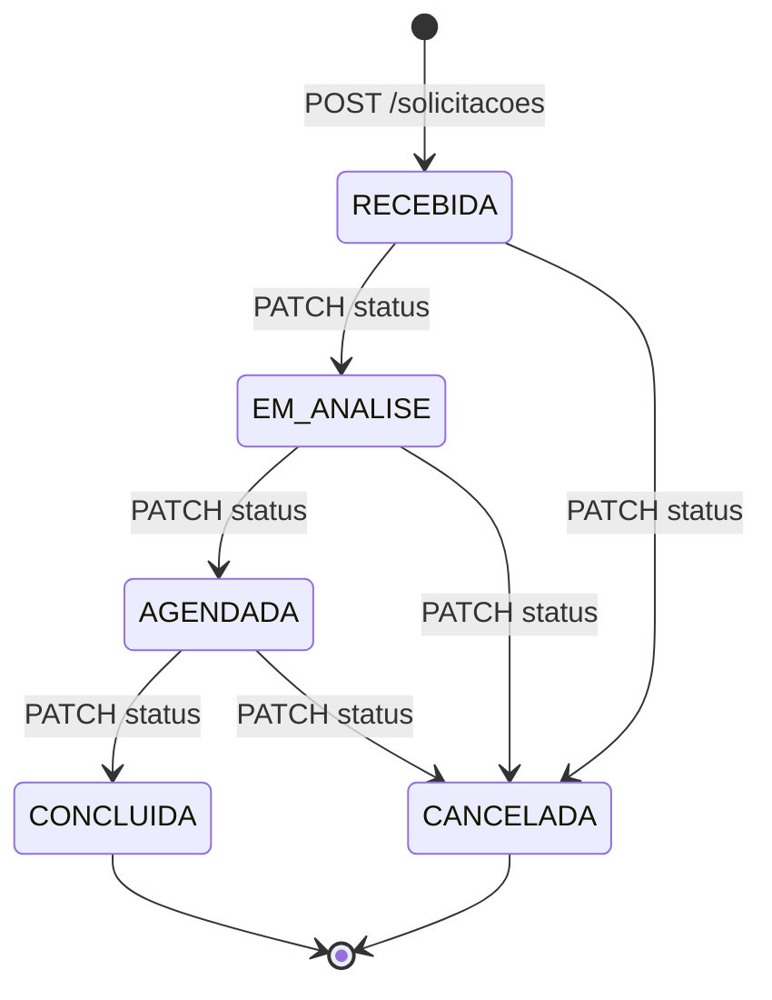

# Arquitetura — V-Lab Solicitações

## Visão Geral

```
┌─────────────┐   HTTP/JSON   ┌──────────────────────────┐   pg_pdo   ┌──────────────┐
│  React SPA  │ ───────────► │   Laravel 11 API (PHP 8.3) │ ─────────► │ PostgreSQL 16│
│  (Vite/TS)  │ ◄─────────── │   porta 8000               │ ◄───────── │  porta 5432  │
└─────────────┘               └──────────────────────────┘            └──────────────┘
   porta 5173                         │
                              RequestId Middleware
                              (X-Request-ID header)
                              Logs JSON → stderr
```

## Fluxo de uma requisição

```mermaid
sequenceDiagram
    participant C as Client (React)
    participant M as RequestId Middleware
    participant FR as FormRequest
    participant A as Action
    participant DB as PostgreSQL

    C->>M: POST /api/v1/solicitacoes
    M->>M: Gera / propaga UUID X-Request-ID
    M->>FR: CriarSolicitacaoRequest::authorize + rules
    FR-->>C: 422 {message, errors} se inválido
    FR->>A: CriarSolicitacao::execute(validated)
    A->>DB: BEGIN TRANSACTION
    A->>DB: INSERT INTO protocolo_counters ON CONFLICT... FOR UPDATE
    A->>DB: INSERT INTO solicitacoes
    A->>DB: COMMIT
    A-->>FR: Solicitacao
    FR-->>M: 201 SolicitacaoResource (CPF mascarado; sem data de nascimento)
    M->>M: Anexa X-Request-ID na resposta
    M-->>C: 201 {data: {...}} + X-Request-ID header
```

## Diagrama de Status



## Fluxo de agendamento

O agendamento é um dado complementar de `AGENDADA`, não um estado novo. O agendamento inicial continua sendo a transição `EM_ANALISE → AGENDADA` em `AtualizarStatusSolicitacao`; o reagendamento é uma Action separada (`ReagendarSolicitacao`) que só atualiza o `Agendamento` ativo (e `agendado_para`, quando a modalidade é HORARIO) — nunca muda `solicitacoes.status`.

```mermaid
sequenceDiagram
    participant F as AgendamentoForm (React)
    participant R as FormRequest
    participant H as HorarioAgendamento / TurnoAgendamento
    participant A as Action
    participant DB as PostgreSQL

    F->>R: PATCH /solicitacoes/{id}/status {AGENDADA, data_agendada, hora_agendada|turno}
    F->>R: PATCH /solicitacoes/{id}/agendamento {data_agendada, hora_agendada|turno}
    alt modalidade HORARIO
        R->>H: HorarioAgendamento::interpretarLocal(data, hora, AGENDAMENTO_TIMEZONE)
        H-->>R: instante UTC (ou 422 se inexistente/ambíguo/passado)
    else modalidade TURNO
        R->>H: TurnoAgendamento::fimDoTurnoUtc(data, turno, AGENDAMENTO_TIMEZONE)
        H-->>R: 422 se o turno já terminou
    end
    R->>A: AtualizarStatusSolicitacao / ReagendarSolicitacao
    A->>DB: BEGIN + SELECT ... FOR UPDATE
    A->>DB: INSERT/UPDATE agendamentos (status=AGENDADO, modalidade, turno, hora_agendada)
    Note over R,H: turno é sempre gravado, nas duas modalidades — em HORARIO,<br/>vem de TurnoAgendamento::derivarDaHora(hora_agendada), calculado<br/>na FormRequest antes da Action rodar
    A->>DB: UPDATE solicitacoes.agendado_para (só na modalidade HORARIO; TURNO fica NULL de propósito)
    A-->>F: 200 SolicitacaoResource (agendamentoAtivo + agendado_para em UTC quando houver)
```

A consulta diária (`GET /solicitacoes?data_agendada=`) usa `HorarioAgendamento::limitesUtcDoDia` para o intervalo semiaberto `[início do dia local, início do seguinte)` e ordena por horário, prioridade, protocolo e id. Horários iguais são permitidos: não há capacidade, conflito de vaga nem check-in.

## Estrutura de Pastas (Backend)

```
backend/
├── app/
│   ├── Domain/
│   │   ├── Health/
│   │   │   └── HealthController.php
│   │   └── Solicitacoes/
│   │       ├── Actions/
│   │       │   ├── CriarSolicitacao.php       # lógica de negócio + protocolo + reuso de paciente
│   │       │   ├── AtualizarSolicitacao.php   # edição de dados abertos
│   │       │   ├── AtualizarStatusSolicitacao.php  # máquina de estados + agendamento inicial + fila
│   │       │   ├── ReagendarSolicitacao.php   # só altera o Agendamento ativo de uma AGENDADA
│   │       │   ├── ApagarSolicitacao.php      # extensão documentada
│   │       │   ├── ListarFilaOperacional.php # filtros, prioridade e paginação da fila
│   │       │   ├── RegistrarFaltaAgendamento.php   # marca Agendamento ativo como FALTA
│   │       │   ├── RegistrarTentativaContato.php   # registra contato pós-falta (enum fechado)
│   │       │   └── ReagendarAposFalta.php     # cria novo Agendamento, preserva a FALTA antiga
│   │       ├── Support/
│   │       │   ├── HorarioAgendamento.php     # data/hora local <-> UTC, sem normalização silenciosa
│   │       │   ├── TurnoAgendamento.php       # deriva/limita turno (MANHA/TARDE/NOITE)
│   │       │   └── MascararContato.php        # mascara celular e CPF para a API
│   │       └── Http/
│   │           ├── Controllers/
│   │           │   └── SolicitacaoController.php  # thin controller
│   │           ├── Requests/
│   │           │   ├── CriarSolicitacaoRequest.php
│   │           │   ├── ListarSolicitacoesRequest.php
│   │           │   ├── AtualizarStatusRequest.php
│   │           │   ├── ReagendarSolicitacaoRequest.php
│   │           │   ├── AtualizarSolicitacaoRequest.php
│   │           │   ├── ListarFilaRequest.php
│   │           │   ├── ListarFaltasRequest.php
│   │           │   ├── RegistrarTentativaContatoRequest.php
│   │           │   └── ReagendarAposFaltaRequest.php
│   │           └── Resources/
│   │               ├── SolicitacaoResource.php
│   │               ├── PacienteResumoResource.php
│   │               ├── EntradaFilaResource.php
│   │               ├── AgendamentoResource.php
│   │               └── TentativaContatoResource.php
│   ├── Http/
│   │   └── Middleware/
│   │       └── RequestId.php
│   └── Models/
│       ├── Solicitacao.php
│       ├── Paciente.php
│       ├── Agendamento.php
│       ├── EntradaFila.php
│       └── TentativaContato.php
├── database/
│   ├── factories/
│   │   ├── SolicitacaoFactory.php
│   │   ├── PacienteFactory.php
│   │   ├── AgendamentoFactory.php
│   │   ├── EntradaFilaFactory.php
│   │   └── TentativaContatoFactory.php
│   ├── migrations/
│   └── seeders/
│       ├── DatabaseSeeder.php
│       └── SolicitacoesSeeder.php       # idempotente via firstOrCreate
├── routes/api.php
└── tests/
    └── Feature/
        ├── HealthTest.php
        ├── CriarSolicitacaoTest.php
        ├── AtualizarSolicitacaoTest.php
        ├── AtualizarStatusTest.php
        ├── ListarSolicitacoesTest.php
        ├── ResumoSolicitacoesTest.php
        ├── AgendamentoConstraintsTest.php
        ├── AgendamentoTurnoTest.php
        ├── PacienteSolicitacaoTest.php
        ├── FilaOperacionalTest.php
        ├── FaltasTest.php
        ├── ReagendarSolicitacaoTest.php
        └── ReagendarAposFaltaTest.php
```

## Privacidade e visões do frontend

O Resource omite `data_nascimento` e mascara `cpf_solicitante` nas listagens, na fila e nas respostas de escrita. Somente `GET /solicitacoes/{id}` usa `SolicitacaoResource::detalhe()` para retornar os dados completos. O TypeScript e o OpenAPI separam o tipo de item de lista do tipo de detalhe.

`SolicitacoesPage.tsx` mantém a consulta na URL e os dados compartilhados; `FilaView.tsx`, `AgendaView.tsx` e `FaltasView.tsx` apresentam as visões. O histórico encerrado usa o filtro de status CONCLUIDA/CANCELADA da fila atual.

## Decisões de Design

| Decisão | Escolha | Motivo |
|---|---|---|
| Protocolo único | Upsert + `lockForUpdate` em `protocolo_counters` | Evita race condition sem sequence global; suporta rollback |
| Transições de status | Tabela `TRANSICOES` em Action | Toda regra de negócio fora do controller; fácil de testar |
| Geração de X-Request-ID | Middleware global no grupo `api` | Rastreabilidade sem acoplamento ao domínio |
| Seeders idempotentes | `firstOrCreate(['protocolo' => ...])` | `db:seed` pode rodar N vezes sem duplicar dados |
| Logs estruturados | JSON via `JsonFormatter` → stderr | Compatível com Loki/CloudWatch sem parsear texto |
| Error envelope único | `{message, errors}` em todos os erros | Frontend trata erros de forma uniforme |
| Fila operacional | ListarFilaOperacional ordena entradas abertas por prioridade e antiguidade | Mantém a ordem de atenção estável com paginação e deixa o controller responsável só pela orquestração |
| Agendamento híbrido | Agendar via `PATCH /status`; reagendar via `PATCH /agendamento` | Uma única autoridade para transições; reagendar não é mudança de estado |
| Invariantes de agenda | Agendamento ativo único (`agendamentos.status='AGENDADO'`) validado na Action + lock, não mais por CHECK entre tabelas | Agenda por turno fica sem `agendado_para` de propósito; o CHECK `chk_agendada_com_horario` foi removido na migration `2026_09_22_000006_migrate_agenda_and_replace_legacy_checks` quando a agenda por turno foi introduzida |
| `turno` sempre preenchido | `agendamentos.turno` é `NOT NULL` nas duas modalidades; ao agendar por `HORARIO`, o turno é derivado (`TurnoAgendamento::derivarDaHora`) e persistido no mesmo `INSERT`, dentro da FormRequest/Action — nunca calculado sob demanda na leitura | Permite agrupar/filtrar por turno (agenda, faltas) sem depender de `hora_agendada`, que é exclusiva de `HORARIO`; só `hora_agendada` fica de fora do CHECK em `TURNO`, `turno` nunca fica `NULL` |
| Agenda do dia (`GET /solicitacoes?data_agendada=`) cobre as duas modalidades | Filtro por OR: `agendado_para` no intervalo do dia (HORARIO) OU `Agendamento` ativo com `modalidade=TURNO` e `data_agendada` igual ao dia pedido | `agendado_para` é sempre `NULL` em `TURNO`; um filtro só por esse campo (como havia antes) deixava agendamentos por turno invisíveis na tela de Agenda — bug corrigido em `SolicitacaoController::index()`, coberto por teste em `AgendamentoTurnoTest` |
| Fuso da agenda | UTC no banco/API, `America/Recife` configurável na interpretação | Instante absoluto; horário local ambíguo é rejeitado |
| Horários repetidos | Permitidos (sem UNIQUE) | O edital não define capacidade; conflito exigiria recurso e duração |
| Falta é status do agendamento, não da solicitação | `agendamentos.status` ganha `FALTA`; `solicitacoes.status` continua só a máquina de estados original | Uma ausência não é uma nova etapa do atendimento — a solicitação segue `AGENDADA` enquanto o agendamento específico registra a falta. Isso permite reagendar (novo `Agendamento`) sem perder o histórico da falta original, e concluir corrige o registro (`falta_corrigida_em`) sem apagar `falta_registrada_em` |
| Paciente reaproveitado por CPF | `pacientes` separado de `solicitacoes`, casado por CPF normalizado | O mesmo paciente pode abrir várias solicitações ao longo do tempo; CPF com data de nascimento divergente é tratado como erro de cadastro (422), não como pessoa nova |
| Fila como registro próprio | `entradas_fila` (não reaproveita a ordenação de `GET /solicitacoes`) | A fila operacional contínua (tempo de espera real) é um conceito distinto da listagem paginada e filtrável da tela de solicitações |
| Contato pós-falta enxuto | `tentativas_contato.resultado` é enum fechado, sem texto livre | Reduz dado sensível armazenado e mantém o relatório de faltas simples de auditar |

## Faltas: por que o estado vive no agendamento

Uma falta acontece em um **compromisso específico** (`Agendamento`), não na solicitação como um todo. Modelar `FALTA` em `solicitacoes.status` exigiria voltar para `AGENDADA` (ou inventar um novo estado) ao reagendar, quebrando a máquina de estados original do edital e obrigando a Action de transição a lidar com um caminho de "desfazer falta". Em vez disso:

- `AtualizarStatusSolicitacao` continua sendo a única autoridade de `solicitacoes.status`, sem nenhuma mudança na máquina de estados original;
- `RegistrarFaltaAgendamento` e `RegistrarTentativaContato` operam exclusivamente sobre `Agendamento` e `TentativaContato`;
- reagendar após falta cria um **novo** `Agendamento` (preservando o antigo, agora histórico) em vez de mutar o registro `FALTA`;
- concluir um atendimento cujo agendamento ativo está em `FALTA` corrige esse mesmo registro (`REALIZADO` + `falta_corrigida_em`), sem apagar `falta_registrada_em`.

## Estado implementado e evolução futura

- **Autenticação:** Laravel Sanctum com sessão/cookie para operadores; a API valida operador ativo e aplica políticas por papel.
- **Notificações:** `SolicitacaoStatusAtualizado` é despachado após commit; `CriarNotificacoesOperacionais` roda na fila `database` pelo serviço `worker` do Compose. O registro operacional guarda somente metadados de protocolo/status e destinatário.
- **Eventos:** a transição confirmada não depende da execução do worker. Se o worker parar, os jobs aguardam na tabela `jobs`; falha ao inserir na fila depois do commit pode deixar a chamada HTTP com erro embora o status já esteja persistido.
- **Microsserviços:** Health e Solicitações estão em namespaces separados. Uma extração futura pode começar por um domínio de Agenda, notificações assíncronas via SQS e um API Gateway, sem antecipar essas camadas no monólito.

## Operação da fila de notificações

O serviço `worker` executa `php artisan queue:work database --tries=3 --backoff=5 --timeout=30`. O listener também declara três tentativas e intervalo de cinco segundos. A restrição única `(event_id, user_id)` com `insertOrIgnore` torna o processamento idempotente por evento e operador. Exceções são relançadas para acionar o mecanismo de retry; o log de falha inclui somente `event_id` e `request_id`.

Para operação local, confira `docker compose ps worker` e os logs com `docker compose logs -f worker`. Jobs que esgotarem as tentativas devem ser inspecionados com `php artisan queue:failed`; após corrigir a causa, reexecute pelo identificador com `php artisan queue:retry <id>`. A tabela `failed_jobs` precisa ser acompanhada junto com a fila `jobs`.

A prova automatizada verifica despacho após commit, descarte no rollback, transição persistida antes do worker, processamento real com `queue:work --once`, isolamento entre operador ativo/inativo, idempotência e ausência de dados pessoais no payload/log. A falha do listener e os parâmetros de retry são cobertos. Um job transitório de prova passa pelo worker real: a primeira execução incrementa `attempts` e permanece em `jobs`; a segunda conclui e remove o job. Essa prova exercita o mecanismo do Laravel, enquanto a falha real do listener é coberta separadamente. O esgotamento das três tentativas e a gravação terminal em `failed_jobs` ainda não foram exercitados de ponta a ponta. Sem worker, a transição permanece confirmada e o job pendente pode ser processado quando o worker voltar.

A listagem operacional é ordenada no backend: solicitações ativas antes das encerradas; dentro de cada grupo, prioridade `URGENTE`, `ALTA`, `MEDIA`, `BAIXA`; empates pela criação mais antiga e `id`.