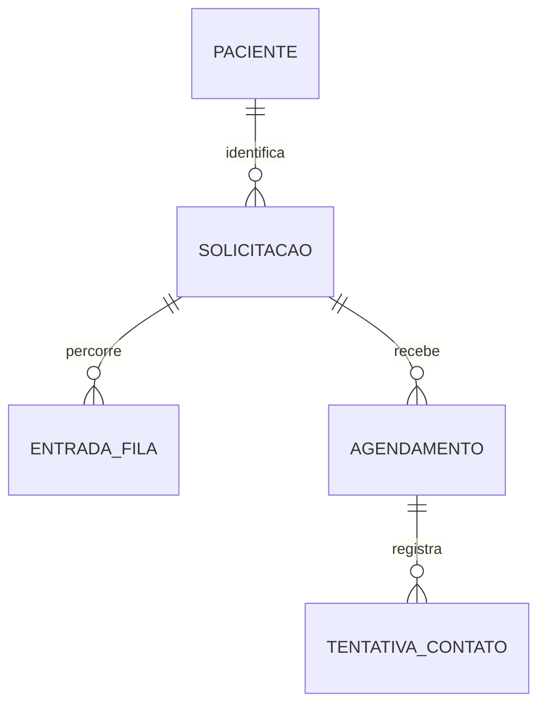

# Design: pacientes, fila, agenda e faltas

**Status:** proposta para revisão

## Objetivo

Evoluir o desafio com uma separação explícita entre solicitação, fila de
espera e agenda, permitindo registrar faltas, tentativas de contato e
reagendamento, sem alterar o contrato obrigatório da solicitação nem a sua
máquina de estados.

## Restrições que prevalecem

O edital continua sendo a fonte de verdade:

- a solicitação mantém protocolo, nome, CPF, nascimento, categoria,
  prioridade, status, descrição, justificativa e datas;
- a máquina de estados permanece exclusivamente em
  `AtualizarStatusSolicitacao`: `RECEBIDA -> EM_ANALISE/CANCELADA`,
  `EM_ANALISE -> AGENDADA/CANCELADA`, `AGENDADA -> CONCLUIDA/CANCELADA`;
- não haverá um status `FALTA` em `solicitacoes`;
- os endpoints já existentes continuam aceitando seu contrato atual;
- toda alteração concorrente usa transação e bloqueio das linhas envolvidas.

Portanto, uma falta é resultado de um **agendamento**, não uma nova situação
da solicitação. Isso é coerente com sistemas de agenda do SUS, que distinguem
agendamento, presença/realização, falta e cancelamento.

## Escopo

1. Reutilizar o cadastro do paciente em novas solicitações pelo CPF.
2. Exibir uma fila contínua de solicitações em análise, ordenada no servidor.
3. Manter uma agenda diária formada por agendamentos ativos.
4. Criar a aba **Faltas**, com histórico da ausência, tentativas de contato e
   reagendamento.
5. Preservar a rastreabilidade de um atendimento mesmo quando houver nova
   marcação.

Não faz parte deste incremento: envio real de SMS/WhatsApp, gestão de salas ou
profissionais, limite de vagas, integração com SISREG/e-SUS ou retorno direto
de uma solicitação `AGENDADA` para `EM_ANALISE`.

## Modelo de domínio



### Paciente

`pacientes` guarda a identidade reutilizável:

- `id`, `nome`, `cpf` único, `data_nascimento`, `celular` opcional,
  timestamps;
- CPF e nascimento são normalizados e validados;
- celular é armazenado somente como dado de contato administrativo, validado
  no formato brasileiro e mascarado nas listagens;
- o campo será opcional para não quebrar solicitações já existentes nem a API
  obrigatória. A interface o solicita quando disponível e sinaliza quando não
  há contato cadastrado;
- não há disparo de mensagem nem uso de dados reais em seeders, testes ou
  documentação.

`solicitacoes` recebe `paciente_id`, mas continua gravando seus campos atuais
de nome, CPF e nascimento como **fotografia histórica**. Ao criar uma nova
solicitação, o backend localiza ou cria o paciente pelo CPF; caso nome ou
nascimento conflitem com o cadastro existente, responde 422 em vez de mesclar
pessoas indevidamente.

### Fila de espera

`entradas_fila` representa uma passagem pela fila, não uma fila diária:

- `id`, `solicitacao_id`, `entrou_em`, `encerrada_em`,
  `motivo_encerramento` (`AGENDAMENTO` ou `CANCELAMENTO`), timestamps;
- existe no máximo uma entrada aberta por solicitação;
- ela é criada, na mesma transação, quando a solicitação transita de
  `RECEBIDA` para `EM_ANALISE`;
- é encerrada quando a solicitação é agendada ou cancelada.

A fila é contínua: a tela mostra as entradas abertas e aplica a ordenação já
definida pelo projeto — prioridade decrescente e, dentro dela, as mais antigas
primeiro. A agenda, em contraste, é uma visão por dia e horário.

### Agenda e falta

`agendamentos` substitui a noção de que uma única data em `solicitacoes` é
toda a história da agenda e suporta uma marcação precisa ou somente por
período:

- `id`, `solicitacao_id`, `data_agendada`, `modalidade`
  (`HORARIO` ou `TURNO`), `hora_agendada` anulável, `turno`
  (`MANHA`, `TARDE` ou `NOITE`), `status`
  (`AGENDADO`, `REALIZADO`, `FALTA`, `CANCELADO`), `resultado_em`,
  `falta_registrada_em`, `falta_corrigida_em`, timestamps;
- índice parcial garante apenas um agendamento `AGENDADO` por solicitação;
- `solicitacoes.agendado_para` deixa de ser a fonte de verdade: permanece
  como campo de compatibilidade apenas para marcações `HORARIO`, recebendo o
  instante UTC correspondente; vale `null` quando a marcação é por `TURNO`.

Os períodos são fixos e centralizados numa única regra compartilhada pelo
backend e frontend: `MANHA` é 06:00–11:59, `TARDE` 12:00–17:59 e `NOITE`
18:00–05:59 do dia seguinte. Em `HORARIO`, o turno é sempre derivado da hora
e não pode ser informado manualmente. Em `TURNO`, não há hora artificial.

CHECKs impedem combinações ambíguas: `HORARIO` exige hora e turno; `TURNO`
exige turno e proíbe hora. Uma solicitação `AGENDADA` exige um agendamento
ativo, e não mais o preenchimento isolado de `solicitacoes.agendado_para`.

Registrar falta só é permitido para um agendamento ativo após seu momento de
referência: após a hora precisa para `HORARIO`; após o término do período para
`TURNO` (12:00, 18:00 ou 06:00 do dia seguinte, respectivamente). A ação
grava `FALTA` e a data do registro em transação. A solicitação permanece
`AGENDADA`; assim, não se inventa uma transição fora do edital.

Se a falta foi lançada por engano e o atendimento foi realizado, a conclusão
pela rota obrigatória marca o agendamento como `REALIZADO` e preenche
`falta_corrigida_em`. A informação de que houve um lançamento de falta não é
apagada, preservando o histórico administrativo.

`tentativas_contato` armazena uma tentativa telefônica posterior à falta:

- `id`, `agendamento_id`, `resultado` (`SEM_RESPOSTA`, `RECADO`, `CONFIRMOU_RETORNO`,
  `NUMERO_INVALIDO`), `realizada_em`, timestamps;
- só pode ser inserida para um agendamento em falta;
- não possui campo de observação, justificativa, diagnóstico ou conteúdo de
  mensagem: só registra um resultado administrativo objetivo.

Reagendar uma falta cria um **novo** agendamento `AGENDADO` e mantém o antigo
como `FALTA`. Desse modo, a aba de faltas conserva o ocorrido e a agenda exibe
apenas o novo horário ativo.

## Compatibilidade com a máquina de estados

As transições obrigatórias continuam idênticas. A action central será estendida
apenas com efeitos atômicos consequentes à transição:

| Transição da solicitação | Efeito adicional |
| --- | --- |
| `RECEBIDA -> EM_ANALISE` | cria a entrada de fila aberta |
| `EM_ANALISE -> AGENDADA` | cria o primeiro agendamento e encerra a entrada de fila |
| `AGENDADA -> CONCLUIDA` | conclui o agendamento ativo, ou corrige uma falta lançada incorretamente |
| `* -> CANCELADA` | encerra a entrada de fila aberta e cancela o agendamento ativo, se existir |

Não será implementado `AGENDADA -> EM_ANALISE` para “devolver à fila”: isso
contradiria expressamente o edital. Após uma falta, o atendente poderá
reagendar ou cancelar a solicitação. Se houver necessidade de novo fluxo de
regulação, uma nova solicitação do mesmo paciente é aberta normalmente, com
novo protocolo e estado `RECEBIDA`.

## API

As rotas existentes de solicitação e agendamento são preservadas. As rotas
adicionais, dentro de `/api/v1`, são:

| Método e rota | Finalidade |
| --- | --- |
| `GET /fila` | lista entradas de fila abertas, com filtros permitidos e paginação |
| `GET /faltas` | lista agendamentos em falta, com paciente, solicitação e último contato |
| `POST /agendamentos/{id}/falta` | registra falta de agendamento elegível |
| `POST /agendamentos/{id}/tentativas-contato` | registra uma tentativa de contato após falta |
| `POST /agendamentos/{id}/reagendar-apos-falta` | cria o novo horário após falta |

As respostas usam Resources e os erros continuam no formato
`{ message, errors }`: 422 para dados inválidos e 409 para conflito de estado,
duplicidade de agendamento ativo ou concorrência de resolução.

`PATCH /solicitacoes/{id}/status` continua sendo a única via que autoriza
transições da solicitação. `PATCH /solicitacoes/{id}/agendamento` mantém seu
comportamento atual para alterar a marcação ativa; o novo endpoint de
reagendamento é reservado para preservar uma falta já registrada.

## Interface

A navegação atual ganha a visão `faltas`, preservando `fila`, `agenda` e
`historico` na URL. Cada visão trata carregamento, sucesso, vazio e erro.

- **Fila:** posição contextual, prioridade, tempo de espera e filtros.
- **Agenda:** somente agendamentos `AGENDADO` para a data escolhida, agrupados
  em Manhã, Tarde e Noite. Dentro de cada grupo, horários definidos aparecem
  em ordem crescente antes das marcações somente por turno.
- **Faltas:** data/hora da falta, paciente, protocolo, telefone mascarado,
  último resultado de contato e ações de registrar contato/reagendar. O
  formulário de contato contém exclusivamente um resultado fechado; data e
  hora são automáticas.
- **Detalhe da solicitação:** linha do tempo de agendamentos, incluindo a falta
  anterior e o reagendamento subsequente.
- **Cadastro:** CPF permite reaproveitar paciente; campos obrigatórios do
  edital continuam visíveis e preenchidos na solicitação. Telefone é campo
  complementar e não bloqueia o fluxo se ausente.

## Migração segura

1. Criar `pacientes`, `entradas_fila`, `agendamentos` e
   `tentativas_contato`, com CHECKs, FKs e índices.
2. Adicionar `paciente_id` inicialmente anulável em `solicitacoes`.
3. Criar e associar pacientes a partir dos snapshots existentes por CPF;
   somente então tornar a FK obrigatória.
4. Migrar cada `agendado_para` existente para um agendamento `HORARIO`, com
   data/hora no fuso operacional e turno derivado: `REALIZADO` se a
   solicitação estiver concluída, `CANCELADO` se cancelada e `AGENDADO` se
   estiver agendada.
5. Criar entradas abertas para solicitações já em `EM_ANALISE`.
6. Substituir os CHECKs legados de `solicitacoes` que exigem `agendado_para`
   por validação transacional da existência de agendamento ativo, sem invalidar
   o histórico já migrado.

## Testes e verificação

Antes da implementação, os testes Pest serão escritos e observados falhar.
Cada action terá, no mínimo, um caminho válido e um inválido:

- criação/reuso de paciente e conflito de identidade por CPF;
- criação/encerramento concorrente da entrada de fila;
- agendamento ao transitar para `AGENDADA`;
- derivação de turno em 07:00, 14:00 e 19:00; marcação por turno sem hora;
- CHECKs que rejeitam hora ausente em `HORARIO`, hora presente em `TURNO` e
  turno divergente da hora;
- falta antes/depois do horário e tentativa de contato fora de falta;
- falta por turno antes/depois do fim do período;
- reagendamento preservando o agendamento em falta e a unicidade ativa;
- cancelamento e conclusão sem burlar a máquina de estados;
- filtros, paginação, serialização e autorização de cada nova rota.

No frontend, os testes mockarão o cliente HTTP e cobrirão abas, estados
assíncronos, abertura da ação de contato e reagendamento. Ao fim, serão
executadas as suítes backend/frontend, lint, build e atualização do grafo.

## Decisões conscientemente adiadas

- capacidade por profissional, sala ou procedimento;
- regras clínicas de prioridade e prazo máximo;
- disparo e recebimento de mensagens reais;
- permissões por perfil de operador;
- integração externa de regulação.

Essas extensões podem ser adicionadas sem alterar o núcleo proposto: o paciente
continua estável, a solicitação conserva seu contrato, a fila é contínua e a
agenda mantém seu histórico.

## Contrato de execução para implementação

Esta seção é normativa para quem implementar a feature. Se houver conflito,
prevalecem o edital e as restrições do início deste documento.

### Limites e responsabilidades

- Não criar Repository, DTO, CQRS, Event Sourcing, fila assíncrona ou nova
  autenticação para esta entrega.
- Manter controllers como `FormRequest -> Action -> Resource`; regras e
  transações ficam em Actions do domínio `Solicitacoes`.
- `AtualizarStatusSolicitacao` permanece a única autoridade para transições de
  `solicitacoes.status`. Actions de falta, contato e reagendamento não podem
  mudar esse status por conta própria.
- Todo dado retornado ao React é tipado; não usar `any`, ordenação local para
  corrigir paginação ou inferência de totais a partir da página carregada.
- Dados de demonstração são fictícios; telefone nunca é exibido por inteiro em
  listas, cartões ou logs.

### Esquema e integridade PostgreSQL

Criar migrations Laravel, nesta ordem lógica:

1. `pacientes`: CPF único, nome, nascimento, celular anulável e timestamps.
   Armazenar CPF normalizado; não colocar unicidade no celular.
2. Adicionar `paciente_id` anulável a `solicitacoes`, preencher a partir do
   snapshot de CPF e depois tornar a FK não anulável. Não remover
   `nome_solicitante`, `cpf_solicitante` nem `data_nascimento`.
3. `entradas_fila`: FK de solicitação, entrada/encerramento, motivo de
   encerramento e índice parcial único em `solicitacao_id` quando
   `encerrada_em IS NULL`.
4. `agendamentos`: campos descritos acima, FK e índices em
   `(data_agendada, turno, hora_agendada)`, `status` e índice parcial único em
   `solicitacao_id` quando `status = 'AGENDADO'`.
5. `tentativas_contato`: FK, CHECK de resultado, sem canal selecionável nem
   coluna de texto livre; índice em `agendamento_id, realizada_em DESC`.
6. Migrar marcações existentes e só então substituir os CHECKs legados de
   `solicitacoes`: a regra passa a validar a existência do agendamento ativo
   na Action, pois um CHECK entre tabelas não é possível no PostgreSQL.

O CHECK de `agendamentos` deve exprimir exatamente:

```text
(modalidade = 'HORARIO' AND hora_agendada IS NOT NULL AND turno IS NOT NULL)
OR
(modalidade = 'TURNO' AND hora_agendada IS NULL AND turno IS NOT NULL)
```

O backend recalcula o turno de uma hora recebida e não confia em valor enviado
pelo cliente. Para turno puro, não aceitar `hora_agendada`; para horário, não
aceitar `turno` no request. Isso elimina divergência entre os dois campos.

### Entrada de agendamento e compatibilidade

Para entrada em `AGENDADA`, e para reagendamento, aceitar apenas uma destas
formas:

```json
{ "data_agendada": "2026-09-25", "hora_agendada": "07:00" }
```

```json
{ "data_agendada": "2026-09-25", "turno": "MANHA" }
```

Ambas exigem data futura no fuso operacional configurado. A primeira cria
`modalidade=HORARIO`, converte data/hora local para UTC e atualiza o campo
legado `agendado_para`. A segunda cria `modalidade=TURNO` e grava
`agendado_para=null`. A combinação hora + turno, ou a ausência dos dois,
retorna 422 com erro associado ao campo relevante.

`ReagendarSolicitacao` pode atualizar a marcação ativa porque é compatível com
o comportamento já entregue. `ReagendarAposFalta` deve criar uma nova linha;
ela nunca sobrescreve a linha em falta. Toda leitura/mutação de solicitação e
agendamento concorrentes usa `DB::transaction()` e `lockForUpdate()`.

### Ações e invariantes

| Action | Pré-condição bloqueada | Resultado atômico |
| --- | --- | --- |
| `CriarSolicitacao` | CPF válido; identidade sem conflito | localiza/cria paciente, preserva snapshot e gera protocolo atual |
| `AtualizarStatusSolicitacao` para `EM_ANALISE` | transição oficial permitida | atualiza solicitação e abre entrada de fila |
| `AtualizarStatusSolicitacao` para `AGENDADA` | transição oficial + payload de marcação válido | cria primeiro agendamento ativo, espelha `agendado_para` quando houver hora e fecha fila |
| `RegistrarFaltaAgendamento` | agendamento ativo e período já encerrado | marca `FALTA` e registra momento da falta |
| `RegistrarTentativaContato` | agendamento em `FALTA` | insere somente resultado e instante atual |
| `ReagendarAposFalta` | agendamento em `FALTA`, sem novo ativo | cria novo agendamento ativo com a forma escolhida |
| `AtualizarStatusSolicitacao` para `CONCLUIDA` | transição oficial permitida | finaliza agendamento ativo; se corrigir falta, mantém `falta_registrada_em` e preenche `falta_corrigida_em` |
| `AtualizarStatusSolicitacao` para `CANCELADA` | transição oficial permitida | fecha entrada de fila aberta e/ou cancela a marcação ativa |

Não existe action nem endpoint para devolver uma solicitação `AGENDADA` a
`EM_ANALISE`. Depois de falta, as opções são reagendar, cancelar, ou iniciar
uma nova solicitação do mesmo paciente pelo fluxo normal.

### Recursos e rotas

Preservar todas as rotas existentes. Adicionar Resources tipados para paciente
resumido, entrada de fila, agendamento e tentativa de contato; eles devem
retornar datas ISO e rótulos podem ser resolvidos no frontend.

| Rota | Parâmetros essenciais | Ordenação/resultado |
| --- | --- | --- |
| `GET /api/v1/fila` | prioridade, categoria, página | somente entrada aberta; prioridade desc., `entrou_em` asc. |
| `GET /api/v1/faltas` | data, resultado_contato, página | somente `FALTA`; falta mais recente primeiro |
| `POST /api/v1/agendamentos/{id}/falta` | nenhum | 201/200 com o agendamento atualizado |
| `POST /api/v1/agendamentos/{id}/tentativas-contato` | `resultado` | 201 com a tentativa criada |
| `POST /api/v1/agendamentos/{id}/reagendar-apos-falta` | data + hora **ou** data + turno | 201 com novo agendamento |

Todos os requests rejeitam campos extras. Os erros mantêm o envelope
`{ message, errors }`; usar 422 para formato, validação e elegibilidade de
data, e 409 para estado concorrente/incompatível. Atualizar `docs/openapi.yaml`
com exemplos de hora e turno, páginas, respostas de sucesso, 409 e 422.

### Arquitetura da experiência

Há um único **Centro operacional**, na rota inicial, em vez de dashboards
independentes. Ele usa navegação horizontal no desktop e controles que quebram
em linhas no celular. As cinco visões são profundas na mesma URL por
`?visao=`; cada uma preserva seus filtros relevantes, data e paginação ao
voltar/avançar.

| Visão | Pergunta respondida | Conteúdo acima da dobra | Ação principal |
| --- | --- | --- | --- |
| Visão geral | O que exige decisão agora? | urgentes, fila, agenda de hoje, faltas pendentes e próxima solicitação | abrir próxima solicitação |
| Fila | Quem precisa ser analisado? | filtros e lista paginada de entradas abertas | analisar/agendar |
| Agenda | Quem é esperado neste dia? | seletor de data e grupos Manhã/Tarde/Noite | abrir atendimento/registrar falta |
| Faltas | Quem não compareceu e o que fazer? | lista objetiva de faltas e último resultado de contato | registrar contato/reagendar |
| Histórico | O que foi encerrado? | busca e filtros de concluídas/canceladas | abrir detalhe |

A Visão geral não é uma segunda lista: mostra números globais da API, uma
única próxima decisão e atalhos contextualizados. Não usar gráfico, carrossel
ou animação decorativa; números e badges sempre têm rótulo textual, e cores de
prioridade/status não transmitem significado sozinhas.

Na Agenda, cada seção de turno exibe: contador, marcações com hora crescente e
depois marcações sem hora com o texto "Por turno". Para `NOITE`, a data
mostrada é a do início do período. O filtro de data é fixado na URL e não muda
automaticamente na virada do dia.

Na aba Faltas, cada cartão/linha contém apenas nome, protocolo, data e
hora/turno da falta, telefone mascarado e último resultado de contato. O modal
"Registrar contato" contém quatro radios — Sem resposta, Recado deixado,
Confirmou retorno e Número inválido — e os botões Salvar/Cancelar. Não existe
campo de texto, justificativa ou exclusão. A data/hora da tentativa é gerada no
servidor. "Reagendar" abre o formulário de Agenda com data e escolha exclusiva
entre hora e turno.

### Componentes, acessibilidade e responsividade

- Reutilizar `AgendamentoForm`, evoluindo-o com um controle de modalidade.
  Ao digitar/escolher hora, apresentar o turno derivado como texto somente de
  leitura; ao escolher turno, ocultar/desabilitar o campo de hora. Nunca
  permitir os dois modos simultaneamente.
- Criar componentes por domínio apenas quando reutilizados: agrupador de turno,
  linha/cartão de falta e diálogo de contato. Não criar biblioteca visual nova.
- Manter os tokens institucionais existentes: azul-marinho para estrutura,
  verde-petróleo para ação principal, superfícies claras, raio máximo 12 px e
  movimento apenas como feedback.
- Formulários usam labels visíveis, `fieldset`/`legend` para radios,
  `aria-describedby` para ajuda/erros, resumo de erros focalizável e botões
  desabilitados enquanto a requisição está pendente.
- Cada tela cobre carregando, sucesso, vazio e erro com ação de recuperação.
  Em vazio de Faltas, explicar que não há ausências pendentes; em erro, oferecer
  nova tentativa sem ocultar filtros.
- Validar 320/375, 768, 1024 e 1440 px: em celular, tabs e chips quebram em
  linha, filtros empilham, tabelas viram cartões rotulados e ações têm ao menos
  44 px de altura. Sem rolagem horizontal.

### Matriz mínima de testes

Escrever testes que falham antes de cada Action/contrato e então implementar o
menor código que os torne verdes. Além das regras listadas na seção anterior,
cobrir:

- concorrência: dois comandos de agendamento/reagendamento não criam dois
  ativos; falta e conclusão concorrentes preservam um resultado válido;
- migração: dados legados com horário tornam-se `HORARIO` com turno correto;
- API: paginação/ordem de fila, grupos de agenda, telefone mascarado, payloads
  extras rejeitados e os envelopes 409/422;
- frontend com HTTP mockado: troca de visões pela URL e Voltar/Avançar,
  horário 07:00 exibindo Manhã, marcação por turno sem hora, quatro resultados
  de contato, reabertura da agenda ao reagendar e todos os estados assíncronos;
- acessibilidade: navegação por teclado, foco no diálogo, labels/radios e texto
  complementar aos badges de prioridade/status.

Ao finalizar, atualizar README (funcionalidades, limitações, instruções e uso
de IA), OpenAPI, `docs/architecture.md`, `TASKS.md` e `HANDOFF.md`; executar
Pest no PostgreSQL, Vitest, lint, build e `graphify update .`.
