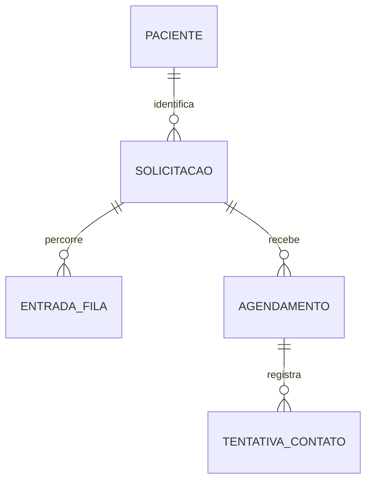

# Design: pacientes, fila, agenda e faltas

**Status:** proposta para revisão

## Objetivo

Evoluir o desafio com uma separação explícita entre solicitação, fila de
espera e agenda, permitindo registrar faltas, tentativas de contato e
reagendamento, sem alterar o contrato obrigatório da solicitação nem a sua
máquina de estados.

## Restrições que prevalecem

O edital continua sendo a fonte de verdade:

- a solicitação mantém protocolo, nome, CPF, nascimento, categoria,
  prioridade, status, descrição, justificativa e datas;
- a máquina de estados permanece exclusivamente em
  `AtualizarStatusSolicitacao`: `RECEBIDA -> EM_ANALISE/CANCELADA`,
  `EM_ANALISE -> AGENDADA/CANCELADA`, `AGENDADA -> CONCLUIDA/CANCELADA`;
- não haverá um status `FALTA` em `solicitacoes`;
- os endpoints já existentes continuam aceitando seu contrato atual;
- toda alteração concorrente usa transação e bloqueio das linhas envolvidas.

Portanto, uma falta é resultado de um **agendamento**, não uma nova situação
da solicitação. Isso é coerente com sistemas de agenda do SUS, que distinguem
agendamento, presença/realização, falta e cancelamento.

## Escopo

1. Reutilizar o cadastro do paciente em novas solicitações pelo CPF.
2. Exibir uma fila contínua de solicitações em análise, ordenada no servidor.
3. Manter uma agenda diária formada por agendamentos ativos.
4. Criar a aba **Faltas**, com histórico da ausência, tentativas de contato e
   reagendamento.
5. Preservar a rastreabilidade de um atendimento mesmo quando houver nova
   marcação.

Não faz parte deste incremento: envio real de SMS/WhatsApp, gestão de salas ou
profissionais, limite de vagas, integração com SISREG/e-SUS ou retorno direto
de uma solicitação `AGENDADA` para `EM_ANALISE`.

## Modelo de domínio

### Paciente

`pacientes` guarda a identidade reutilizável:

- `id`, `nome`, `cpf` único, `data_nascimento`, `celular` opcional,
  timestamps;
- CPF e nascimento são normalizados e validados;
- celular é armazenado somente como dado de contato administrativo, validado
  no formato brasileiro e mascarado nas listagens;
- o campo será opcional para não quebrar solicitações já existentes nem a API
  obrigatória. A interface o solicita quando disponível e sinaliza quando não
  há contato cadastrado;
- não há disparo de mensagem nem uso de dados reais em seeders, testes ou
  documentação.

`solicitacoes` recebe `paciente_id`, mas continua gravando seus campos atuais
de nome, CPF e nascimento como **fotografia histórica**. Ao criar uma nova
solicitação, o backend localiza ou cria o paciente pelo CPF; caso nome ou
nascimento conflitem com o cadastro existente, responde 422 em vez de mesclar
pessoas indevidamente.

### Fila de espera

`entradas_fila` representa uma passagem pela fila, não uma fila diária:

- `id`, `solicitacao_id`, `entrou_em`, `encerrada_em`,
  `motivo_encerramento` (`AGENDAMENTO` ou `CANCELAMENTO`), timestamps;
- existe no máximo uma entrada aberta por solicitação;
- ela é criada, na mesma transação, quando a solicitação transita de
  `RECEBIDA` para `EM_ANALISE`;
- é encerrada quando a solicitação é agendada ou cancelada.

A fila é contínua: a tela mostra as entradas abertas e aplica a ordenação já
definida pelo projeto — prioridade decrescente e, dentro dela, as mais antigas
primeiro. A agenda, em contraste, é uma visão por dia e horário.

### Agenda e falta

`agendamentos` substitui a noção de que uma única data em `solicitacoes` é
toda a história da agenda:

- `id`, `solicitacao_id`, `agendado_para`,
  `status` (`AGENDADO`, `REALIZADO`, `FALTA`, `CANCELADO`), `resultado_em`,
  `falta_registrada_em`, `falta_corrigida_em`, timestamps;
- índice parcial garante apenas um agendamento `AGENDADO` por solicitação;
- a coluna atual `solicitacoes.agendado_para` permanece por compatibilidade
  com o contrato existente e é atualizada junto ao agendamento ativo.

Registrar falta só é permitido após o horário marcado e para um agendamento
ativo. A ação grava `FALTA` e a data do registro em transação. A solicitação
permanece `AGENDADA`; assim, não se inventa uma transição fora do edital.

Se a falta foi lançada por engano e o atendimento foi realizado, a conclusão
pela rota obrigatória marca o agendamento como `REALIZADO` e preenche
`falta_corrigida_em`. A informação de que houve um lançamento de falta não é
apagada, preservando o histórico administrativo.

`tentativas_contato` armazena contato posterior à falta:

- `id`, `agendamento_id`, `canal` (`TELEFONE`, `SMS`, `WHATSAPP`),
  `resultado` (`SEM_RESPOSTA`, `RECADO`, `CONFIRMOU_RETORNO`,
  `NUMERO_INVALIDO`), `observacao` curta opcional, `realizada_em`,
  timestamps;
- só pode ser inserida para um agendamento em falta;
- não registra conteúdo sensível, diagnóstico ou mensagem enviada.

Reagendar uma falta cria um **novo** agendamento `AGENDADO` e mantém o antigo
como `FALTA`. Desse modo, a aba de faltas conserva o ocorrido e a agenda exibe
apenas o novo horário ativo.

## Compatibilidade com a máquina de estados

As transições obrigatórias continuam idênticas. A action central será estendida
apenas com efeitos atômicos consequentes à transição:

| Transição da solicitação | Efeito adicional |
| --- | --- |
| `RECEBIDA -> EM_ANALISE` | cria a entrada de fila aberta |
| `EM_ANALISE -> AGENDADA` | cria o primeiro agendamento e encerra a entrada de fila |
| `AGENDADA -> CONCLUIDA` | conclui o agendamento ativo, ou corrige uma falta lançada incorretamente |
| `* -> CANCELADA` | encerra a entrada de fila aberta e cancela o agendamento ativo, se existir |

Não será implementado `AGENDADA -> EM_ANALISE` para “devolver à fila”: isso
contradiria expressamente o edital. Após uma falta, o atendente poderá
reagendar ou cancelar a solicitação. Se houver necessidade de novo fluxo de
regulação, uma nova solicitação do mesmo paciente é aberta normalmente, com
novo protocolo e estado `RECEBIDA`.

## API

As rotas existentes de solicitação e agendamento são preservadas. As rotas
adicionais, dentro de `/api/v1`, são:

| Método e rota | Finalidade |
| --- | --- |
| `GET /fila` | lista entradas de fila abertas, com filtros permitidos e paginação |
| `GET /faltas` | lista agendamentos em falta, com paciente, solicitação e último contato |
| `POST /agendamentos/{id}/falta` | registra falta de agendamento elegível |
| `POST /agendamentos/{id}/tentativas-contato` | registra uma tentativa de contato após falta |
| `POST /agendamentos/{id}/reagendar-apos-falta` | cria o novo horário após falta |

As respostas usam Resources e os erros continuam no formato
`{ message, errors }`: 422 para dados inválidos e 409 para conflito de estado,
duplicidade de agendamento ativo ou concorrência de resolução.

`PATCH /solicitacoes/{id}/status` continua sendo a única via que autoriza
transições da solicitação. `PATCH /solicitacoes/{id}/agendamento` mantém seu
comportamento atual para alterar o horário de um agendamento ativo; o novo
endpoint de reagendamento é reservado para preservar uma falta já registrada.

## Interface

A navegação atual ganha a visão `faltas`, preservando `fila`, `agenda` e
`historico` na URL. Cada visão trata carregamento, sucesso, vazio e erro.

- **Fila:** posição contextual, prioridade, tempo de espera e filtros.
- **Agenda:** somente agendamentos `AGENDADO` para a data escolhida.
- **Faltas:** data/hora da falta, paciente, protocolo, telefone mascarado,
  último resultado de contato e ações de registrar contato/reagendar.
- **Detalhe da solicitação:** linha do tempo de agendamentos, incluindo a falta
  anterior e o reagendamento subsequente.
- **Cadastro:** CPF permite reaproveitar paciente; campos obrigatórios do
  edital continuam visíveis e preenchidos na solicitação. Telefone é campo
  complementar e não bloqueia o fluxo se ausente.

## Migração segura

1. Criar `pacientes`, `entradas_fila`, `agendamentos` e
   `tentativas_contato`, com CHECKs, FKs e índices.
2. Adicionar `paciente_id` inicialmente anulável em `solicitacoes`.
3. Criar e associar pacientes a partir dos snapshots existentes por CPF;
   somente então tornar a FK obrigatória.
4. Migrar cada `agendado_para` existente para um agendamento: `REALIZADO` se
   a solicitação estiver concluída, `CANCELADO` se cancelada e `AGENDADO` se
   estiver agendada.
5. Criar entradas abertas para solicitações já em `EM_ANALISE`.
6. Manter os CHECKs atuais de `solicitacoes` e evoluí-los apenas para não
   invalidar o histórico de agenda já migrado.

## Testes e verificação

Antes da implementação, os testes Pest serão escritos e observados falhar.
Cada action terá, no mínimo, um caminho válido e um inválido:

- criação/reuso de paciente e conflito de identidade por CPF;
- criação/encerramento concorrente da entrada de fila;
- agendamento ao transitar para `AGENDADA`;
- falta antes/depois do horário e tentativa de contato fora de falta;
- reagendamento preservando o agendamento em falta e a unicidade ativa;
- cancelamento e conclusão sem burlar a máquina de estados;
- filtros, paginação, serialização e autorização de cada nova rota.

No frontend, os testes mockarão o cliente HTTP e cobrirão abas, estados
assíncronos, abertura da ação de contato e reagendamento. Ao fim, serão
executadas as suítes backend/frontend, lint, build e atualização do grafo.

## Decisões conscientemente adiadas

- capacidade por profissional, sala ou procedimento;
- regras clínicas de prioridade e prazo máximo;
- disparo e recebimento de mensagens reais;
- permissões por perfil de operador;
- integração externa de regulação.

Essas extensões podem ser adicionadas sem alterar o núcleo proposto: o paciente
continua estável, a solicitação conserva seu contrato, a fila é contínua e a
agenda mantém seu histórico.
